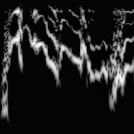
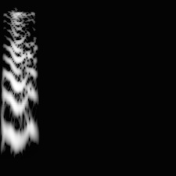
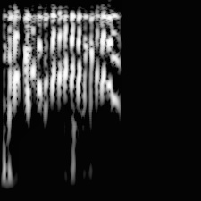
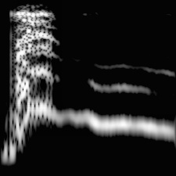
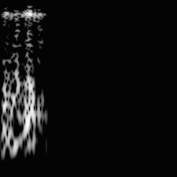
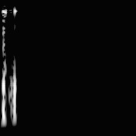
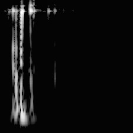
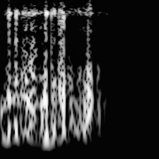

<h1>Budgerigar Spectrogram Generation</h1>
<div>
    Budgerigars display an astounding range of vocal plasticity. To capture this natural vocalization behavior, our lab opted for using piezoelectric microphones for audio analysis. The benefit of doing so over traditional (ambient) microphones is that audio quality is almost perfectly preserved even in noisy environments.
</div>

<br/>
<div>
    The main drawback to relying on piezoelectric microphone data is its high signal to noise ratio, as it is very sensitive to any kinds of vibrations (wing flapping, feeding, etc.). Bird audio recordings can range from hours to over a 24-hour period, with periods of singing representing a very small portion of the total recording duration. Thus, it is an arduious task to segment and label such audio files by hand.
</div>

<br/>

<div>
    I have implemented a neural-network-based binary classifier to differentiate vocalizations from noise. This package will generate mel-scale spectrograms from an audio segment and its corresponding label file (event detections). These generated images are then used as the input to the neural network.
</div>

<div>
    <h3>Vocalization Examples:</h3>
    
    
    
    
</div>

<div>
    <h3>Noise Examples:</h3>
    
    
    
    
</div>

<h2>Spectrogram Generation</h2>
<div>
    Audio event detections are first high-pass filtered and zero-padded or cut to a length of 224 ms. Mel-scale spectrograms are generated from audio event detections using a window size of 8 ms and hop length of 1 ms with 225 frequency bands. 
</div>
<br/>
<div>
    To transform this task to traditional image classification, spectrogram values are mapped to a 0-255 range to output a size 225x225 grayscale image. To enhance fine-detail visibility, the CLAHE algorithm is applied.
</div>

<h2>Usage</h2>
Change the audio and label paths to match that of your audio files in spec_options.toml, and then run the following command in the terminal. 

```console
python src/main.py spec_options.toml
```